> **HANDOFF BUILD — customer-owned, unsigned, editable (not an attested artifact).**

<!-- This README was generated by HexaBox Studio bundleBuilder.
     Vertical-themed banner colors derive from skin preset `default-orange`. -->

# HexaForge SLM Training Master

**Runtime mode: `reference`** — fail-closed skeleton. Unimplemented CUSTOMER_SLOTs stay blocking stubs; the opt-in reference harness (`DOER_REFERENCE_MODE`, posture-gated) may emit contract-derived, disclosed-synthetic outputs marked `"reference": true`. NOT domain logic.

**Purity score:** 86/100 (structural build-purity gate — the generator emitted sound structure; NOT a deploy-readiness claim — see PROVENANCE.json)

> **New here?** Start with **[STATUS.md](STATUS.md)** — what is built, what is in progress, and the exact commands to **verify the signed build yourself, offline**. The UI design brief is in **[`docs/design/`](docs/design/)**. This repo is the editable *handoff*; the signed, offline-verifiable artifact is the **[v0.1.0 release](../../releases)**.

 <defs> <linearGradient id='g' x1='0%' y1='0%' x2='100%' y2='0%'> <stop offset='0%' stop-color='%230F0F28'/> <stop offset='50%' stop-color='%231A1A3E'/> <stop offset='100%' stop-color='%230F0F28'/> </linearGradient> </defs> <rect width='800' height='120' fill='url(%23g)'/> <g opacity='0.15'> <circle cx='100' cy='60' r='40' fill='none' stroke='%23F97316' stroke-width='1'/> <circle cx='100' cy='60' r='60' fill='none' stroke='%23F97316' stroke-width='0.5'/> <circle cx='700' cy='60' r='40' fill='none' stroke='%23FB923C' stroke-width='1'/> </g> <text x='40' y='55' fill='%23E6E8F2' font-family='JetBrains Mono, monospace' font-size='12' letter-spacing='3'>HEXABOX STUDIO · AI-ML-OPS</text> <text x='40' y='92' fill='%23F97316' font-family='Inter, sans-serif' font-size='28' font-weight='700'>HexaForge SLM Training Master</text> </svg>" alt="HexaForge SLM Training Master banner" width="100%"/>

       

**Status:** generated scaffold — 18 customer slots awaiting implementation, 0 AI-bound nodes (1 provider binding configured, not yet exercised by the emitted code — see `capability_truth.json`).

This repository is a generated controlled-agent scaffold prepared for LLM
binding. Doctrine gates, port contracts, runtime and tests are generated;
the vertical business logic lives in marked CUSTOMER_SLOT extension points
(`src/nodes/*/handler.py`).

## 🎯 Target capability (when bound)

> This agent orchestrates the lifecycle of SLM training jobs, from planning and execution to evaluation and deployment, ensuring strict adherence to governance policies, data quality, and auditability. It supports both single-tenant and k-anonymized multi-tenant data scenarios. Hybrid vertical: ai-ml-ops + governance-risk-compliance + data-privacy.

**What the green test suite proves — and its honest boundary:** every
generated contract, gate, auth path, audit binding and fail-closed hold is
dynamically tested. Tests reported as SKIPPED are CUSTOMER_SLOT-blocked
steps: full happy-path passage to egress and an executed privileged action
are structurally enforced (blocking stubs fail safe, `disposition: hold`,
`release_allowed: false`) but NOT dynamically proven until those slots are
implemented. `verify_release.sh` restates this boundary in its summary.

## Capability Truth

**What this is:** a governed, contract-complete, cryptographically signed, *runnable* agent chassis. It boots (`docker compose up`), every port carries a typed contract, the doctrine validator passes by construction, a tamper-evident H7 audit chain records every action, and CCAS tier gates guard the privileged ones — a *fail-closed approval seam* (approvals must be structured, action-bound, **tenant-bound**, role-scoped, signed and **single-use** — a releasing approval is consumed in a persistent ledger before release and can never release again **on that host** (Fas 2.22: the consume cycle is atomic under an exclusive `flock`, which is advisory and per-host — a multi-replica deployment must bind a shared compare-and-set store for cross-replica single-use, exactly as `src/shared/approval_ledger.py` states); explicit expiries are signature-bound; the approval backend `CCAS_APPROVAL_KEY` is yours to bind, and until it is, gated tiers never release; and the declared `idempotency_key` is ENFORCED, not documented — a reservation on (tenant_id, action, key) is taken before any side effect, so a replay is suppressed with the prior outcome rather than executed twice, on that host, with the same shared-store caveat). **This structural layer — governance, contracts, gates, signature — is done by construction, not by hand, not by hope. The *other* hard part — the domain competence — is not done, and is yours to bind (next section).**

_"Cryptographically signed" is precise: **every delivered file** is sha256-hashed into `MANIFEST.json`, whose canonical hash is Ed25519-signed inside `identity.json` (`conformance.manifest`). `verify_identity.py` re-derives the manifest and re-hashes every file **before any bundle code runs** — so a change to any delivered byte of a MANIFESTED file (even one that breaks no test) is detected — those are hash- and size-bound, so whitespace counts. The signature-referential files listed below are bound SEMANTICALLY instead; the distinction is stated precisely there rather than papered over. The only files outside the manifest are the signature-referential ones and are listed, signed, in `conformance.manifest.excluded`: `identity.json`, `generator.pub`, `root.pub`, `MANIFEST.json` itself, `GENESIS.md` (embeds the signed identity) and `PROVENANCE.json`. Each of those is still integrity-bound: `identity.json` is **itself Ed25519-signed in full** — the signature covers every field except `signature` (Fas 2.23: including `capabilities`, `signed_at`, `algorithm` and the generator/root pubkeys), so a change to any SEMANTIC byte of it is detected too — the signature covers the canonical JSON of those fields, not the file's exact serialisation, so reformatting (whitespace, key order) verifies while any change of MEANING fails; that is canonical semantic integrity, and it is what the verifier actually proves; `generator.pub` / `root.pub` are pinned byte-for-byte to the signed `generator_pubkey_b64` / `root_pubkey_b64`; `MANIFEST.json`'s own canonical hash IS the signed `conformance.manifest.manifest_sha256`; `GENESIS.md` embeds and is derived from the signed identity; and `PROVENANCE.json` is informational build provenance — the authoritative, signed `provenance_hash` is recomputed by the verifier from `karta.compiled.json`, so PROVENANCE.json itself is not integrity-critical. The transitive hash-locked `requirements.lock`, the full CycloneDX `sbom/cyclonedx.json` and — once the factory has measured the registry digest — `deploy/base-image.lock` are measured by the factory (the dependency set is bundle-invariant) and **born into this bundle as SIGNED files in the manifest** — measured before export, not by a post-delivery CI bootstrap. Nothing supply-chain-related appears after signing (the shipped workflow is verify-only, and the signed `measured_outputs` list is empty). One further SIGNED list, `runtime_outputs` (the bundle's own audit log, engine reports, eval outputs), declares the only files that legitimately appear *after* signing and are therefore tolerated — and disclosed — by the verifier, never silently ignored. The chain extends to the *running container*: the emitted build workflow bakes this bundle's identity into the image as OCI labels (resolved from the SIGNED files at build time) and Sigstore-attests the pushed digest — re-verify per `docs/verify_built_image.md`. Anchor the chain **out-of-band**: obtain this verifier's own sha256 AND the HexaBox **root fingerprint** (the sha256 of `root.pub`) from Forseti/Studio through a channel other than this bundle. The in-bundle `root.pub` is a convenience copy — it becomes a trust anchor only once its fingerprint matches the out-of-band one (see `docs/verify_root_fingerprint.md`)._

**What it is not (yet):** a trained domain expert. The runtime boots, every node endpoint is callable, every port carries a typed contract, and the audit chain records; the composed pipeline **executes until an explicitly blocking unimplemented capability is reached — then fails safely** (disposition `hold`, release withheld). A *complete domain result* requires the declared stub capabilities to be implemented (or explicitly configured as non-blocking). The domain competence is yours to bind. To *prove the chassis itself* runs end-to-end, a **factory reference mode** ships (`DOER_REFERENCE_MODE=1`, explicit opt-in, default OFF): unimplemented slots return contract-derived outputs marked `"reference": true` and the privileged gate performs a side-effect-free reference execution **after** CCAS approval — approval provenance is never relaxed (signed, action-bound approvals still required). It is a test harness, not domain logic, and `tests/integration_tests/test_reference_capability.py` proves the full happy path through the action gate with a verified audit chain. Node state — **derived from the generated code, not hand-written:**

```
IMPLEMENTED (platform/gated)23   intake · decision_ledger · decision · egress · start_training_job_approval_gate · requeue_job_approval_gate · +17
AI-BOUND                     0   —
HEURISTIC (baseline)         4   eval_gatekeeper · data_quality_checker · drift_detector · delegation_registrar
STUB (awaiting logic)       18   enrichment · event_parser · campaign_planner · job_supervisor · gpu_telemetry_normalizer · failure_diagnoser · +12
```

Heuristic nodes run a transparent deterministic baseline (labelled in-code as "NOT a trained model") so the pipeline is live from day one — they do not yet encode your domain rules. That is the seam, and it is a clean one.

**To make it production-ready — connect this, add that:**
1. Bind a model to each competency seam → `run_bound_completion()` in the `CUSTOMER_SLOT` of `src/nodes/*/handler.py`.
2. Drop domain data into `seed_data/` → the eval-harness then gates bind-readiness per node.
3. Wire your integrations into the egress connector.
4. Implement any remaining stub nodes.

Every seam is regeneration-safe: your bound logic below the `AUTOGEN-END` marker is never overwritten.

**What 100/100 measures: STRUCTURE.** It is structural conformance against a named doctrine version — not a proof of business-logic correctness, AI output quality, runtime security or GDPR. Those are validated per vertical and deployment.

---

**Doer ID:** `forseti_hexaforge_slm_training_master_agent` &nbsp;·&nbsp; **Vertical:** Ai Ml Ops &nbsp;·&nbsp; **Version:** v1.0.0 &nbsp;·&nbsp; **Generated:** 2026-08-26T18:11:09.495Z

---

## Standards — by construction

This agent fulfils the following standards **by construction** (ai-ml-ops). The governance plane is enforced and re-verifiable offline; the domain plane is an honest skeleton — see `docs/compliance.md` for exactly what you must complete before making any claim.

**Governance plane** — what is enforced and re-verifiable offline is the *mechanism* set: declared privileged actions behind CCAS tier gates, signed and single-use approvals, tenant-bound action hashes, idempotency reservation before side effects, a tamper-evident audit chain, k-anonymity contract shape, and an Ed25519-signed file manifest.

**Evidence is structured for** (mapping, not certification — no accredited audit has been performed against any of these): AIUC-1 · EU AI Act · ISO/IEC 42001 · ISO/IEC 27001 · Zero Trust (NIST 800-207) · GDPR

**This agent engages** (audit-ready evidence structure): GDPR Ch. V *(cross border transfer)* · Schrems II *(cross border transfer)* · PCI-DSS *(pci dss handling)*

> Language is "maps to / audit-ready evidence for", never "certified" or "compliant". Certification is an accredited third-party audit; the skeleton makes the evidence audit-ready.


## 🎬 Quick links

- [Run the demo](./demo/demo_runner.py) — replays a synthetic scenario through the full topology
- [Architecture](./docs/architecture.md) — node-by-node walkthrough
- [Doctrine](./docs/doctrine.md) — which gates this agent passes and why
- [Customer extensions](./docs/customer-extensions.md) — where you plug your model + data + policy

---

## 📐 Topology

```mermaid
graph LR
  hexaforge_slm_training_master_intake_octa[hexaforge slm training master intake octa]:::octa
  hexaforge_slm_training_master_enrichment_hexa{{hexaforge slm training master enrichment hexa}}:::hexa
  hexaforge_slm_training_master_event_parser_hexa{{hexaforge slm training master event parser hexa}}:::hexa
  hexaforge_slm_training_master_campaign_planner_hexa{{hexaforge slm training master campaign planner hexa}}:::hexa
  hexaforge_slm_training_master_job_supervisor_hexa{{hexaforge slm training master job supervisor hexa}}:::hexa
  hexaforge_slm_training_master_gpu_telemetry_normalizer_hexa{{hexaforge slm training master gpu telemetry normalizer hexa}}:::hexa
  hexaforge_slm_training_master_failure_diagnoser_hexa{{hexaforge slm training master failure diagnoser hexa}}:::hexa
  hexaforge_slm_training_master_eval_gatekeeper_hexa{{hexaforge slm training master eval gatekeeper hexa}}:::hexa
  hexaforge_slm_training_master_provenance_recorder_hexa{{hexaforge slm training master provenance recorder hexa}}:::hexa
  hexaforge_slm_training_master_bind_proposer_hexa{{hexaforge slm training master bind proposer hexa}}:::hexa
  hexaforge_slm_training_master_explainer_hexa{{hexaforge slm training master explainer hexa}}:::hexa
  hexaforge_slm_training_master_data_quality_checker_hexa{{hexaforge slm training master data quality checker hexa}}:::hexa
  hexaforge_slm_training_master_decision_ledger_hexa{{hexaforge slm training master decision ledger hexa}}:::hexa
  hexaforge_slm_training_master_artifact_meter_hexa{{hexaforge slm training master artifact meter hexa}}:::hexa
  hexaforge_slm_training_master_data_provenance_recorder_hexa{{hexaforge slm training master data provenance recorder hexa}}:::hexa
  hexaforge_slm_training_master_drift_detector_hexa{{hexaforge slm training master drift detector hexa}}:::hexa
  hexaforge_slm_training_master_retrain_proposer_hexa{{hexaforge slm training master retrain proposer hexa}}:::hexa
  hexaforge_slm_training_master_fleet_binder_hexa{{hexaforge slm training master fleet binder hexa}}:::hexa
  hexaforge_slm_training_master_delegation_registrar_hexa{{hexaforge slm training master delegation registrar hexa}}:::hexa
  hexaforge_slm_training_master_decision_hexa{{hexaforge slm training master decision hexa}}:::hexa
  hexaforge_slm_training_master_model_freshness_validator_hexa{{hexaforge slm training master model freshness validator hexa}}:::hexa
  hexaforge_slm_training_master_safety_validator_hexa{{hexaforge slm training master safety validator hexa}}:::hexa
  hexaforge_slm_training_master_packager_hexa{{hexaforge slm training master packager hexa}}:::hexa
  hexaforge_slm_training_master_egress_octa[hexaforge slm training master egress octa]:::octa
  hexaforge_slm_training_master_learning_store_hexa{{hexaforge slm training master learning store hexa}}:::hexa
  hexaforge_slm_training_master_start_training_job_approval_gate_hexa{{hexaforge slm training master start training job approval gate hexa}}:::hexa
  hexaforge_slm_training_master_requeue_job_approval_gate_hexa{{hexaforge slm training master requeue job approval gate hexa}}:::hexa
  hexaforge_slm_training_master_retry_with_adjustment_approval_gate_hexa{{hexaforge slm training master retry with adjustment approval gate hexa}}:::hexa
  hexaforge_slm_training_master_kill_job_approval_gate_hexa{{hexaforge slm training master kill job approval gate hexa}}:::hexa
  hexaforge_slm_training_master_pause_campaign_approval_gate_hexa{{hexaforge slm training master pause campaign approval gate hexa}}:::hexa
  hexaforge_slm_training_master_resume_campaign_approval_gate_hexa{{hexaforge slm training master resume campaign approval gate hexa}}:::hexa
  hexaforge_slm_training_master_park_job_approval_gate_hexa{{hexaforge slm training master park job approval gate hexa}}:::hexa
  hexaforge_slm_training_master_keep_parked_approval_gate_hexa{{hexaforge slm training master keep parked approval gate hexa}}:::hexa
  hexaforge_slm_training_master_remove_flagged_rows_and_recheck_approval_gate_hexa{{hexaforge slm training master remove flagged rows and recheck approval gate hexa}}:::hexa
  hexaforge_slm_training_master_promote_and_bind_adapter_approval_gate_hexa{{hexaforge slm training master promote and bind adapter approval gate hexa}}:::hexa
  hexaforge_slm_training_master_deny_bind_approval_gate_hexa{{hexaforge slm training master deny bind approval gate hexa}}:::hexa
  hexaforge_slm_training_master_rollback_binding_approval_gate_hexa{{hexaforge slm training master rollback binding approval gate hexa}}:::hexa
  hexaforge_slm_training_master_delete_artifact_approval_gate_hexa{{hexaforge slm training master delete artifact approval gate hexa}}:::hexa
  hexaforge_slm_training_master_trigger_retrain_approval_gate_hexa{{hexaforge slm training master trigger retrain approval gate hexa}}:::hexa
  hexaforge_slm_training_master_bind_adapter_to_fleet_agent_approval_gate_hexa{{hexaforge slm training master bind adapter to fleet agent approval gate hexa}}:::hexa
  hexaforge_slm_training_master_rollback_fleet_binding_approval_gate_hexa{{hexaforge slm training master rollback fleet binding approval gate hexa}}:::hexa
  hexaforge_slm_training_master_grant_shared_adapter_training_approval_gate_hexa{{hexaforge slm training master grant shared adapter training approval gate hexa}}:::hexa
  hexaforge_slm_training_master_issue_delegation_grant_approval_gate_hexa{{hexaforge slm training master issue delegation grant approval gate hexa}}:::hexa
  hexaforge_slm_training_master_revoke_delegation_grant_approval_gate_hexa{{hexaforge slm training master revoke delegation grant approval gate hexa}}:::hexa
  hexaforge_slm_training_master_action_selector_hexa{{hexaforge slm training master action selector hexa}}:::hexa
  hexaforge_slm_training_master_intake_octa --> hexaforge_slm_training_master_enrichment_hexa
  hexaforge_slm_training_master_enrichment_hexa --> hexaforge_slm_training_master_event_parser_hexa
  hexaforge_slm_training_master_event_parser_hexa --> hexaforge_slm_training_master_decision_hexa
  hexaforge_slm_training_master_enrichment_hexa --> hexaforge_slm_training_master_campaign_planner_hexa
  hexaforge_slm_training_master_campaign_planner_hexa --> hexaforge_slm_training_master_decision_hexa
  hexaforge_slm_training_master_enrichment_hexa --> hexaforge_slm_training_master_job_supervisor_hexa
  hexaforge_slm_training_master_job_supervisor_hexa --> hexaforge_slm_training_master_decision_hexa
  hexaforge_slm_training_master_enrichment_hexa --> hexaforge_slm_training_master_gpu_telemetry_normalizer_hexa
  hexaforge_slm_training_master_gpu_telemetry_normalizer_hexa --> hexaforge_slm_training_master_decision_hexa
  hexaforge_slm_training_master_enrichment_hexa --> hexaforge_slm_training_master_failure_diagnoser_hexa
  hexaforge_slm_training_master_failure_diagnoser_hexa --> hexaforge_slm_training_master_decision_hexa
  hexaforge_slm_training_master_enrichment_hexa --> hexaforge_slm_training_master_eval_gatekeeper_hexa
  hexaforge_slm_training_master_eval_gatekeeper_hexa --> hexaforge_slm_training_master_decision_hexa
  hexaforge_slm_training_master_enrichment_hexa --> hexaforge_slm_training_master_provenance_recorder_hexa
  hexaforge_slm_training_master_provenance_recorder_hexa --> hexaforge_slm_training_master_decision_hexa
  hexaforge_slm_training_master_enrichment_hexa --> hexaforge_slm_training_master_bind_proposer_hexa
  hexaforge_slm_training_master_bind_proposer_hexa --> hexaforge_slm_training_master_decision_hexa
  hexaforge_slm_training_master_enrichment_hexa --> hexaforge_slm_training_master_explainer_hexa
  hexaforge_slm_training_master_explainer_hexa --> hexaforge_slm_training_master_decision_hexa
  hexaforge_slm_training_master_enrichment_hexa --> hexaforge_slm_training_master_data_quality_checker_hexa
  hexaforge_slm_training_master_data_quality_checker_hexa --> hexaforge_slm_training_master_decision_hexa
  hexaforge_slm_training_master_enrichment_hexa --> hexaforge_slm_training_master_decision_ledger_hexa
  hexaforge_slm_training_master_decision_ledger_hexa --> hexaforge_slm_training_master_decision_hexa
  hexaforge_slm_training_master_enrichment_hexa --> hexaforge_slm_training_master_artifact_meter_hexa
  hexaforge_slm_training_master_artifact_meter_hexa --> hexaforge_slm_training_master_decision_hexa
  hexaforge_slm_training_master_enrichment_hexa --> hexaforge_slm_training_master_data_provenance_recorder_hexa
  hexaforge_slm_training_master_data_provenance_recorder_hexa --> hexaforge_slm_training_master_decision_hexa
  hexaforge_slm_training_master_enrichment_hexa --> hexaforge_slm_training_master_drift_detector_hexa
  hexaforge_slm_training_master_drift_detector_hexa --> hexaforge_slm_training_master_decision_hexa
  hexaforge_slm_training_master_enrichment_hexa --> hexaforge_slm_training_master_retrain_proposer_hexa
  hexaforge_slm_training_master_retrain_proposer_hexa --> hexaforge_slm_training_master_decision_hexa
  hexaforge_slm_training_master_enrichment_hexa --> hexaforge_slm_training_master_fleet_binder_hexa
  hexaforge_slm_training_master_fleet_binder_hexa --> hexaforge_slm_training_master_decision_hexa
  hexaforge_slm_training_master_enrichment_hexa --> hexaforge_slm_training_master_delegation_registrar_hexa
  hexaforge_slm_training_master_delegation_registrar_hexa --> hexaforge_slm_training_master_decision_hexa
  hexaforge_slm_training_master_intake_octa --> hexaforge_slm_training_master_model_freshness_validator_hexa
  hexaforge_slm_training_master_model_freshness_validator_hexa --> hexaforge_slm_training_master_egress_octa
  hexaforge_slm_training_master_egress_octa --> hexaforge_slm_training_master_learning_store_hexa
  hexaforge_slm_training_master_learning_store_hexa --> hexaforge_slm_training_master_intake_octa
  hexaforge_slm_training_master_decision_hexa --> hexaforge_slm_training_master_action_selector_hexa
  hexaforge_slm_training_master_action_selector_hexa --> hexaforge_slm_training_master_start_training_job_approval_gate_hexa
  hexaforge_slm_training_master_start_training_job_approval_gate_hexa --> hexaforge_slm_training_master_egress_octa
  hexaforge_slm_training_master_action_selector_hexa --> hexaforge_slm_training_master_requeue_job_approval_gate_hexa
  hexaforge_slm_training_master_requeue_job_approval_gate_hexa --> hexaforge_slm_training_master_egress_octa
  hexaforge_slm_training_master_action_selector_hexa --> hexaforge_slm_training_master_retry_with_adjustment_approval_gate_hexa
  hexaforge_slm_training_master_retry_with_adjustment_approval_gate_hexa --> hexaforge_slm_training_master_egress_octa
  hexaforge_slm_training_master_action_selector_hexa --> hexaforge_slm_training_master_kill_job_approval_gate_hexa
  hexaforge_slm_training_master_kill_job_approval_gate_hexa --> hexaforge_slm_training_master_egress_octa
  hexaforge_slm_training_master_action_selector_hexa --> hexaforge_slm_training_master_pause_campaign_approval_gate_hexa
  hexaforge_slm_training_master_pause_campaign_approval_gate_hexa --> hexaforge_slm_training_master_egress_octa
  hexaforge_slm_training_master_action_selector_hexa --> hexaforge_slm_training_master_resume_campaign_approval_gate_hexa
  hexaforge_slm_training_master_resume_campaign_approval_gate_hexa --> hexaforge_slm_training_master_egress_octa
  hexaforge_slm_training_master_action_selector_hexa --> hexaforge_slm_training_master_park_job_approval_gate_hexa
  hexaforge_slm_training_master_park_job_approval_gate_hexa --> hexaforge_slm_training_master_egress_octa
  hexaforge_slm_training_master_action_selector_hexa --> hexaforge_slm_training_master_keep_parked_approval_gate_hexa
  hexaforge_slm_training_master_keep_parked_approval_gate_hexa --> hexaforge_slm_training_master_egress_octa
  hexaforge_slm_training_master_action_selector_hexa --> hexaforge_slm_training_master_remove_flagged_rows_and_recheck_approval_gate_hexa
  hexaforge_slm_training_master_remove_flagged_rows_and_recheck_approval_gate_hexa --> hexaforge_slm_training_master_egress_octa
  hexaforge_slm_training_master_action_selector_hexa --> hexaforge_slm_training_master_promote_and_bind_adapter_approval_gate_hexa
  hexaforge_slm_training_master_promote_and_bind_adapter_approval_gate_hexa --> hexaforge_slm_training_master_egress_octa
  hexaforge_slm_training_master_action_selector_hexa --> hexaforge_slm_training_master_deny_bind_approval_gate_hexa
  hexaforge_slm_training_master_deny_bind_approval_gate_hexa --> hexaforge_slm_training_master_egress_octa
  hexaforge_slm_training_master_action_selector_hexa --> hexaforge_slm_training_master_rollback_binding_approval_gate_hexa
  hexaforge_slm_training_master_rollback_binding_approval_gate_hexa --> hexaforge_slm_training_master_egress_octa
  hexaforge_slm_training_master_action_selector_hexa --> hexaforge_slm_training_master_delete_artifact_approval_gate_hexa
  hexaforge_slm_training_master_delete_artifact_approval_gate_hexa --> hexaforge_slm_training_master_egress_octa
  hexaforge_slm_training_master_action_selector_hexa --> hexaforge_slm_training_master_trigger_retrain_approval_gate_hexa
  hexaforge_slm_training_master_trigger_retrain_approval_gate_hexa --> hexaforge_slm_training_master_egress_octa
  hexaforge_slm_training_master_action_selector_hexa --> hexaforge_slm_training_master_bind_adapter_to_fleet_agent_approval_gate_hexa
  hexaforge_slm_training_master_bind_adapter_to_fleet_agent_approval_gate_hexa --> hexaforge_slm_training_master_egress_octa
  hexaforge_slm_training_master_action_selector_hexa --> hexaforge_slm_training_master_rollback_fleet_binding_approval_gate_hexa
  hexaforge_slm_training_master_rollback_fleet_binding_approval_gate_hexa --> hexaforge_slm_training_master_egress_octa
  hexaforge_slm_training_master_action_selector_hexa --> hexaforge_slm_training_master_grant_shared_adapter_training_approval_gate_hexa
  hexaforge_slm_training_master_grant_shared_adapter_training_approval_gate_hexa --> hexaforge_slm_training_master_egress_octa
  hexaforge_slm_training_master_action_selector_hexa --> hexaforge_slm_training_master_issue_delegation_grant_approval_gate_hexa
  hexaforge_slm_training_master_issue_delegation_grant_approval_gate_hexa --> hexaforge_slm_training_master_egress_octa
  hexaforge_slm_training_master_action_selector_hexa --> hexaforge_slm_training_master_revoke_delegation_grant_approval_gate_hexa
  hexaforge_slm_training_master_revoke_delegation_grant_approval_gate_hexa --> hexaforge_slm_training_master_egress_octa
  hexaforge_slm_training_master_action_selector_hexa --> hexaforge_slm_training_master_egress_octa
  hexaforge_slm_training_master_intake_octa --> hexaforge_slm_training_master_safety_validator_hexa
  hexaforge_slm_training_master_safety_validator_hexa --> hexaforge_slm_training_master_egress_octa
  hexaforge_slm_training_master_intake_octa --> hexaforge_slm_training_master_packager_hexa
  hexaforge_slm_training_master_packager_hexa --> hexaforge_slm_training_master_egress_octa
  classDef octa fill:#0F0F28,stroke:#F97316,stroke-width:2px,color:#E6E8F2
  classDef hexa fill:#1A1A3E,stroke:#FB923C,color:#E6E8F2
  classDef hub  fill:#0F0F28,stroke:#F97316,stroke-width:3px,color:#E6E8F2
```



45 nodes · 83 edges · 274/274 port contracts authored

---

## 🛡️ Purpose

Generated by Forseti HexaDoer

## 🎯 Desired output

doctrine-compliant agent karta

---

## 🚀 Quickstart

```bash
# 1. Configure environment
cp .env.example .env

# 2. Run locally with the demo identity (ZT auth stays ON — the demo
#    compose provisions a local, scope-limited demo-token; see
#    demo/docker-compose.demo.yml. Production: deploy/docker-compose.yml
#    + your own ZT_IDENTITIES.)
docker-compose -f demo/docker-compose.demo.yml up --build

# 3. POST a sample event to the COMPOSED AGENT (authenticated — zero trust
#    is fail-closed). /api/events drives the full karta pipeline: audited
#    orchestration, blocking-stub detection (honest hold, never a fake ok),
#    correlation, governed actions and the cohort boundary.
curl -X POST http://localhost:8000/api/events \
  -H 'Content-Type: application/json' \
  -H 'Authorization: Bearer demo-token' \
  -d @demo/sample_event.json
```

Debugging a SINGLE node (contract validation + that node's handler only —
this does NOT exercise the composed pipeline):

```bash
curl -X POST http://localhost:8000/hexaforge_slm_training_master_intake_octa/port-xi \
  -H 'Content-Type: application/json' \
  -H 'Authorization: Bearer demo-token' \
  -d @demo/sample_event.json
```

CEVE-Light structural validation:

```bash
cd validator && ./run_validation.sh
```

What this does NOT validate: business logic correctness, AI output quality,
runtime security, GDPR compliance.

---

## 🧠 SLM enablement — what ships, and what does not

The capability strip above says **AI-BOUND 0**, and that is true: no node in this
artifact calls a model. It does NOT mean the model layer is absent — it means it
is *unbound*, and everything needed to bind it ships here.

`training/` carries one enablement pack per model-bindable node, each derived
from that node's OWN competence and IO contract (not a per-vertical template):

| File | What it is |
|---|---|
| `model_card.md` | what this node's SLM must do, derived from its own XI/XO contract |
| `io_contract.json` | the input/output schemas the model must satisfy + the gate rule |
| `seed_data/` | a **synthetic** contract-shaped bootstrap (`train.jsonl`, `eval.jsonl`) with `label_provenance.json` stating exactly that |
| `eval/` | the contract eval-harness and its acceptance thresholds — the hard gate |
| `recipe/` | fine-tune config + Makefile targets (fetch → train → quantize → eval → bind) |

The recommended base model is HexaLearn-resolved by competence signature and
recorded in `training/shelf.lock.json`, where every entry states its own
integrity: `measured` (a real sha256) or `unpinned` (`null` — a candidate, not a
lock, to be pinned and verified at fetch).

**The honest boundary:** this bundle ships the enablement chain, not trained
weights. The seed corpora are synthetic bootstraps, not domain-labelled data.
Binding a model is gated by the eval-harness in `eval/` — bind only when it
passes `acceptance.md`. Nothing here claims a trained, evaluated domain model.

---

## 🔌 Customer extension points

This is your skeleton. The platform leaves these clearly marked for you
to customize without breaking doctrine:

### Code (your business logic)

| Where | What you replace | Doctrine boundary |
|-------|------------------|-------------------|
| `src/nodes/*/handler.py` | LLM/SLM model + your business logic | Inputs/outputs validated by `schemas.json` |
| `src/shared/hexa_learn.py` | Cohort/federated-learning providers (embedding + similarity) | Cross-tenant cohort doctrine |
| `src/shared/anonymization.py` | Your anonymization implementation | ARTIFACT_ANON_CONTRACT verifies output shape |

### Policy contracts (your doctrine)

| Where | What you replace | Doctrine boundary |
|-------|------------------|-------------------|
| `contracts/hexaforge_slm_training_master_intake_octa/yi.schema.json` | Policy rules (constraints.hard) | Doctrine re-verification (`H12`, `H_PORT_CONTRACT_UNIQUE`) on every PR |
| `contracts/hexaforge_slm_training_master_enrichment_hexa/yi.schema.json` | Policy rules (constraints.hard) | Doctrine re-verification (`H12`, `H_PORT_CONTRACT_UNIQUE`) on every PR |
| `contracts/hexaforge_slm_training_master_event_parser_hexa/yi.schema.json` | Policy rules (constraints.hard) | Doctrine re-verification (`H12`, `H_PORT_CONTRACT_UNIQUE`) on every PR |
| `contracts/hexaforge_slm_training_master_campaign_planner_hexa/yi.schema.json` | Policy rules (constraints.hard) | Doctrine re-verification (`H12`, `H_PORT_CONTRACT_UNIQUE`) on every PR |
| `contracts/hexaforge_slm_training_master_job_supervisor_hexa/yi.schema.json` | Policy rules (constraints.hard) | Doctrine re-verification (`H12`, `H_PORT_CONTRACT_UNIQUE`) on every PR |
| `contracts/hexaforge_slm_training_master_intake_octa/mo.schema.json` | Anonymization fields (k≥5) | ARTIFACT_ANON_CONTRACT + H_COHORT_ANONYMITY enforce canonical schema |
| `contracts/hexaforge_slm_training_master_egress_octa/mo.schema.json` | Anonymization fields (k≥5) | ARTIFACT_ANON_CONTRACT + H_COHORT_ANONYMITY enforce canonical schema |

### What's locked

Anything outside the files listed above is **doctrine-locked**. PR template
will warn you if a change crosses the boundary. If you need to modify
locked files, regenerate the skeleton via HexaBox Studio with an updated
agent spec.

---

## 🔗 Binding an LLM provider

The scaffold ships with **1** active LLM binding. To bind one:

1. Copy `provider-credentials.env.example` values into your `.env` and fill
   in the provider key(s) — server-side only, never shipped to clients or
   committed to VCS.
2. Bind models per node in HexaBox Studio (`studio_node_ai_bindings`), or bind
   one inside a CUSTOMER_SLOT in `src/nodes/<node>/handler.py` via the shared
   helper `src/shared/llm_binding.py` — `run_bound_completion(...)`. The helper
   owns the four Zero Trust invariants for you: the Anthropic client is built
   from `resolve_credential("anthropic")` (ZT-1, never a static key); untrusted
   event content is spotlighted (ZT-4 — `isolate_untrusted()`); the model answer
   is validated against the node's XO contract before emit (invalid → FAIL); and
   every call is audited to the HexaRecord chain (prompt-hash, not raw text).
   Tests inject a fake via `set_llm_client(...)` so they run with no net/key.
3. Keep emitted payloads conformant to `contracts/<node>/<port>.schema.json` —
   CEVE-Light structural validation enforces shape, not output quality.

---

## 📁 What's in this repository

```
🗺️  karta.yaml             Composed topology (the "what" — the originating JobSpec/Q&A record lives in the Studio build record)
🎬 demo/                  Playable scenarios (the "watch it work")
🐍 src/                   Bundle-generated Python skeleton (the "how")
   nodes/                   Per-node code + port handlers + schemas
   shared/                  Cross-cutting: cohort, anonymization, audit
📜 contracts/             Per-port JSON schemas (the "doctrine")
🧠 training/              SLM enablement packs — one per model-bindable node
🎨 docs/                  Architecture, doctrine, customer-extensions
🤖 .github/workflows/     CI: doctrine-check runs on every PR
```

---

## 🚀 Deploy

### Local (docker-compose)

```bash
cp .env.example .env
# fill in ANTHROPIC_API_KEY at minimum
docker compose -f deploy/docker-compose.yml up --build
# api: http://localhost:8000/healthz
```

### Production (GHCR image)

Every push to `main` builds a multi-arch image
(`linux/amd64` + `linux/arm64`) via
`.github/workflows/build-image.yml` and publishes to GHCR.

```bash
docker pull ghcr.io/<org>/forseti-hexaforge-slm-training-master-agent:latest

# Run with .env loaded
docker run --rm -p 8000:8000 --env-file .env \
  ghcr.io/<org>/forseti-hexaforge-slm-training-master-agent:latest
```

The image runs as non-root user `doer` and includes a
HEALTHCHECK against `/healthz` — orchestrators (k8s, ECS,
Nomad) get pod-level health out of the box.

### Synthetic events (smoke test)

```bash
# Replay the bundled synthetic scenario through the full topology
# (demo_runner sends the demo bearer token — ZT auth stays ON)
python demo/demo_runner.py

# Or POST a single bundled synthetic event to the composed agent
curl -X POST http://localhost:8000/api/events \
  -H 'Content-Type: application/json' \
  -H 'Authorization: Bearer demo-token' \
  -d @demo/sample_event.json

# (Single-node debugging: POST the same body to /hexaforge_slm_training_master_intake_octa/port-xi —
#  contract + handler only, not the composed pipeline.)
```

### Re-generation (preserves customer code)

If you've added business logic below the `FORSETI-AUTOGEN-END` markers
in any `src/nodes/*/handler.py` and want to refresh the auto-generated
sections from a new Forseti export:

```bash
python -m services.forseti_regen --new-bundle /path/to/fresh-export --dry-run
python -m services.forseti_regen --new-bundle /path/to/fresh-export
```

See `docs/customer-extensions.md` and `python -m services.forseti_regen --help` for the AUTOGEN contract.

---

## 🤝 Contributing

PRs are graded against doctrine. See `.github/pull_request_template.md` —
the CI will paste validator output on your PR, and any doctrine regression
blocks merge.

To regenerate this skeleton with a different spec:
1. Update the agent spec in the Studio
2. Open the agent in HexaBox Studio
3. Click "Generate New Version"
4. Push the new bundle to a branch — same repo, new tag

---

_Generated by HexaBox Studio @ 2026-08-26T18:11:09.495Z · generator studio-1.0.0_
